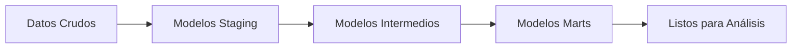

# Pipeline de Transformación de Datos de Fútbol

Un proyecto de dbt (data build tool) diseñado para transformar datos crudos de partidos de fútbol en modelos analíticos para análisis deportivos. Este proyecto procesa datos extraídos de la API de Mediotiempo y crea conjuntos de datos estructurados y listos para el negocio, útiles para el análisis de tablas de liga y el rendimiento de equipos.

Este proyecto forma parte de un pipeline de ingeniería de datos más amplio para análisis deportivos.

## 🎯 Propósito

Esta capa de transformación está específicamente diseñada para:

- Transformar datos crudos de partidos en conjuntos de datos limpios y estructurados
- Calcular puntos y posiciones de los equipos para las tablas de liga
- Crear modelos listos para el negocio orientados al análisis deportivo

## 🛠️ Tecnologías Utilizadas

### Tecnologías Principales

- **dbt Core 1.9.3** - Framework para transformación y modelado de datos
- **dbt Postgres 1.9.0** - Adaptador de PostgreSQL para dbt
- **PostgreSQL** - Almacén de datos destino
- **Python 3.11** - Entorno de ejecución

## 📦 Estructura del Proyecto

```text
project/
├── models/
│   ├── staging/              # Modelos de datos crudos
│   │   ├── sources.yml       # Definiciones de fuentes
│   │   ├── stg_scores.sql    # Resultados de partidos limpiados
│   │   ├── stg_teams.sql     # Tabla de dimensión de equipos
│   │   └── stg_tournaments.sql # Tabla de dimensión de torneos
│   ├── intermediate/         # Transformaciones intermedias
│   │   └── int_team_points.sql # Cálculo de puntos por equipo
│   └── marts/               # Modelos listos para negocio
│       └── final_league_table.sql # Posiciones finales de la liga
├── macros/                  # Macros SQL reutilizables
├── tests/                   # Pruebas de datos personalizadas
├── seeds/                   # Archivos de datos estáticos
├── snapshots/               # Seguimiento SCD tipo 2
├── dbt_project.yml          # Configuración del proyecto
└── profiles.yml             # Perfiles de conexión a la base de datos
```

## 🔧 Arquitectura del Modelo de Datos

### 1. Capa de Staging (`staging/`)

Modelos que limpian y estandarizan los datos crudos desde la zona de aterrizaje:

- **`stg_scores`** - Resultados de partidos limpiados con tipos de datos correctos
- **`stg_teams`** - Tabla de dimensión de equipos sin duplicados
- **`stg_tournaments`** - Metadatos y configuración de torneos

### 2. Capa Intermedia (`intermediate/`)

Transformaciones complejas y lógica de negocio:

- **`int_team_points`** - Calcula los puntos por equipo en cada partido
  - Victoria = 3 puntos, Empate = 1 punto, Derrota = 0 puntos
  - Considera tanto al equipo local como al visitante

### 3. Capa de Marts (`marts/`)

Modelos listos para usuarios finales:

- **`final_league_table`** - Posiciones completas de la liga con ranking de equipos
  - Agrega puntos por temporada, liga y equipo
  - Incluye metadatos de torneo y equipo
  - Ordenado por puntos para generar el ranking

## 🚀 Primeros Pasos

### Requisitos Previos

- Base de datos PostgreSQL con los datos de entrada
- Docker (opcional, para despliegue en contenedor)
- dbt CLI (para desarrollo local)

### Configuración del Entorno

El proyecto se conecta a una base de datos PostgreSQL con la siguiente configuración:

```yaml
database: futbol_db
host: postgres
port: 5432
schema: public
user: superuser
password: superuser_password
```

## 📊 Flujo de Datos



### Lógica de Transformación

1. **Limpieza de Datos** (Staging)
   - Filtrar solo los partidos finalizados
   - Estandarizar tipos y formatos de datos
   - Eliminar duplicados y gestionar valores nulos

2. **Lógica de Negocio** (Intermedia)
   - Calcular resultados de partidos (victoria/empate/derrota)
   - Asignar puntos según el resultado
   - Considerar tanto equipos locales como visitantes

3. **Agregación** (Marts)
   - Sumar puntos por equipo por temporada/liga
   - Unir con tablas de dimensiones para contexto
   - Crear tabla final de posiciones de liga
