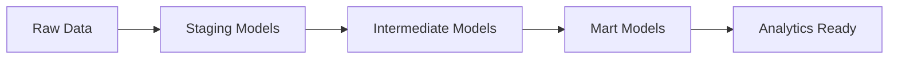

# Football Data Transformation Pipeline

A dbt (data build tool) project designed to transform raw football match data into analytical models for sports analytics. This project processes data extracted from Mediotiempo's API and creates structured, business-ready datasets for league table analysis and team performance insights.

This project is part of a larger data engineering pipeline for sports analytics.

## 🎯 Purpose

This transformation layer is specifically designed to:

- Transform raw match data into clean, structured datasets
- Calculate team points and standings for league tables
- Create business-ready models for sports analytics

## 🛠️ Technologies Used

### Core Technologies

- **dbt Core 1.9.3** - Data transformation and modeling framework
- **dbt Postgres 1.9.0** - PostgreSQL adapter for dbt
- **PostgreSQL** - Target data warehouse
- **Python 3.11** - Runtime environment

## 📦 Project Structure

```text
project/
├── models/
│   ├── staging/              # Raw data models
│   │   ├── sources.yml       # Source definitions
│   │   ├── stg_scores.sql    # Cleaned match scores
│   │   ├── stg_teams.sql     # Team dimension table
│   │   └── stg_tournaments.sql # Tournament dimension table
│   ├── intermediate/         # Intermediate transformations
│   │   └── int_team_points.sql # Team points calculation
│   └── marts/               # Business-ready models
│       └── final_league_table.sql # Final league standings
├── macros/                  # Reusable SQL macros
├── tests/                   # Custom data tests
├── seeds/                   # Static data files
├── snapshots/               # Type 2 SCD tracking
├── dbt_project.yml          # Project configuration
└── profiles.yml             # Database connection profiles
```

## 🔧 Data Model Architecture

### 1. Staging Layer (`staging/`)

Models that clean and standardize raw data from the landing zone:

- **`stg_scores`** - Cleaned match results with proper data types
- **`stg_teams`** - Deduplicated team dimension table
- **`stg_tournaments`** - Tournament metadata and configuration

### 2. Intermediate Layer (`intermediate/`)

Complex transformations and business logic:

- **`int_team_points`** - Calculates points for each team per match
  - Win = 3 points, Draw = 1 point, Loss = 0 points
  - Handles both home and away team perspectives

### 3. Marts Layer (`marts/`)

Business-ready models for end users:

- **`final_league_table`** - Complete league standings with team rankings
  - Aggregates points by season, league, and team
  - Includes tournament and team metadata
  - Ordered by points for ranking

## 🚀 Getting Started

### Prerequisites

- PostgreSQL database with the landing data
- Docker (optional, for containerized deployment)
- dbt CLI (for local development)

### Environment Setup

The project connects to a PostgreSQL database with the following configuration:

```yaml
database: futbol_db
host: postgres
port: 5432
schema: public
user: superuser
password: superuser_password
```

## 📊 Data Flow



### Transformation Logic

1. **Data Cleaning** (Staging)
   - Filter completed matches only
   - Standardize data types and formats
   - Remove duplicates and handle nulls

2. **Business Logic** (Intermediate)
   - Calculate match outcomes (win/draw/loss)
   - Assign points based on results
   - Handle both home and away perspectives

3. **Aggregation** (Marts)
   - Sum points by team per season/league
   - Join with dimension tables for context
   - Create final league standings
